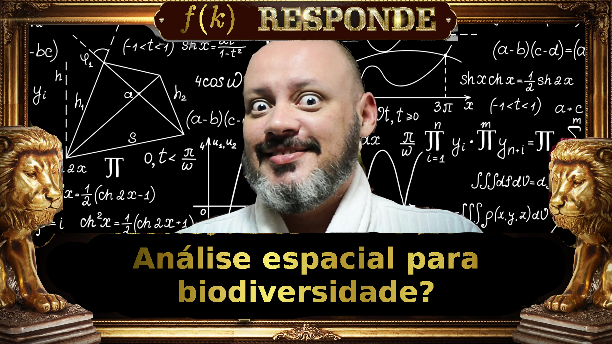

# Análise Espacial no sistema R com foco em Biodiversidade  

Repositório com materiais apresentados no **Congresso Brasileiro de Geotecnologias para o Meio Ambiente (CBGEO)**, como parte da apresentação Análise Espacial no sistema R com foco em Biodiversidade.

## Tutorial:
* **["Análise Espacial no sistema R com foco em Biodiversidade"](https://felipesbarros.github.io/CongressoGeoBiodiversidadeI/AnaliseEspacialBiodiversidade.html)**  
* [Slides](https://felipesbarros.github.io/CongressoGeoBiodiversidadeI/CBGEO_AnaliseEspacialBiodiversidade_FelipeBarros_24_07.pdf)  

**Entenda mais sobre a análise espacial Função K de Ripley!**

## Sobre o autor:  

* Material elaborado por: Felipe Sodré Mendes Barros
* Contatos: felilpe.b4rros [at] gmail.com  
* Github: [FelipeSBarros](https://github.com/FelipeSBarros/)
* Facebook: [felipe.sodre1](https://www.facebook.com/felipe.sodre1)  
* Twitter: [@FelipeSMBarros](https://twitter.com/FelipeSMBarros)  
* YouTube: [GeoCastBrasil](https://www.youtube.com/channel/UCLAeX4dyujMoy4xqHvxSDpQ)  
* Blog [GeoIndepenencia](https://geoind.wordpress.com/)  

## Licensa:
  

#### Você:  

* Deve fazer as devidas referências;  
* Pode adaptar este materrial;  
* Deve compartilhar sua alteração com a mesma licença;  

[Creative Commons Attribution-ShareAlike 4.0 International License](http://creativecommons.org/licenses/by-sa/4.0/)
